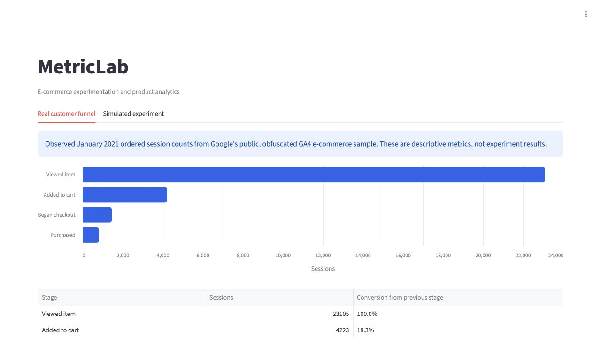
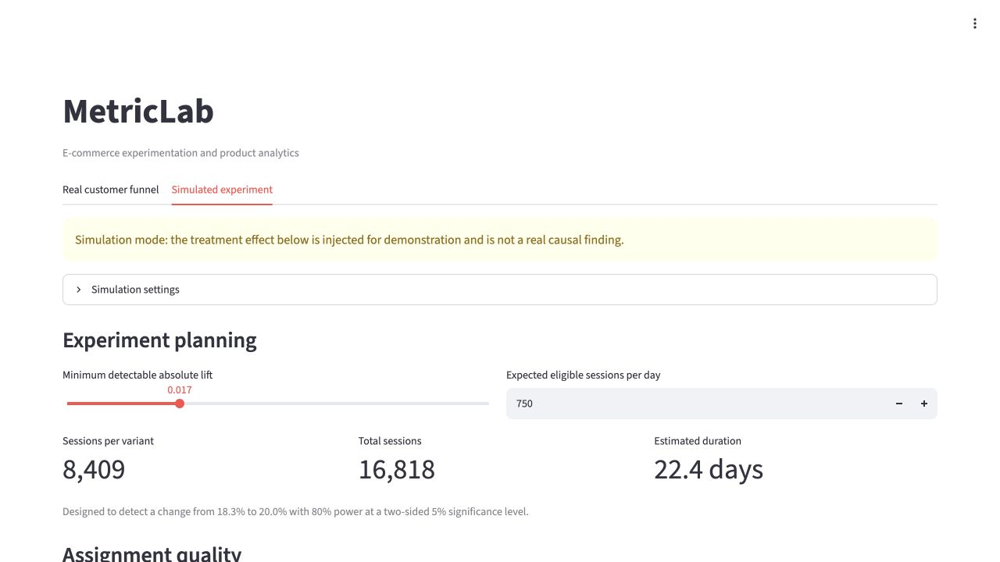

# MetricLab

[](https://github.com/nickyh1024/metriclab/actions/workflows/tests.yml)

MetricLab is an e-commerce experimentation and product analytics platform. It
turns event-level customer behavior into trustworthy experiment results and a
clear product recommendation.

[](https://metriclab-dw6kqwuewkw97j7dlustmp.streamlit.app/)

**Live app:** https://metriclab-dw6kqwuewkw97j7dlustmp.streamlit.app/

The first use case evaluates whether clearer product information and a stronger
call to action improve view-to-cart conversion without reducing revenue per
session.

## What is implemented

- A pre-registered experiment specification in `docs/experiment_spec.md`
- A real, ordered January 2021 session funnel queried from Google's public GA4 sample
- Deterministic synthetic session-level product-page experiment data
- Stable session-level treatment assignment
- Conversion lift, confidence intervals, p-values, and revenue guardrails
- A Streamlit results page
- Unit tests for the statistical core

The dashboard separates observed funnel metrics from simulated experiment
results. The simulated treatment effect is explicitly labeled and is not
evidence about a real product-page redesign.

## Dashboard

### Observed customer funnel



### Experiment planning



## Quick start

Requires Python 3.11 or newer.

```bash
python -m venv .venv
source .venv/bin/activate
pip install -e .
streamlit run app/streamlit_app.py
```

Run tests with:

```bash
python -m unittest discover -s tests -v
```

## Roadmap

1. Add automated data-quality checks.
2. Add CUPED variance reduction as an advanced extension.
